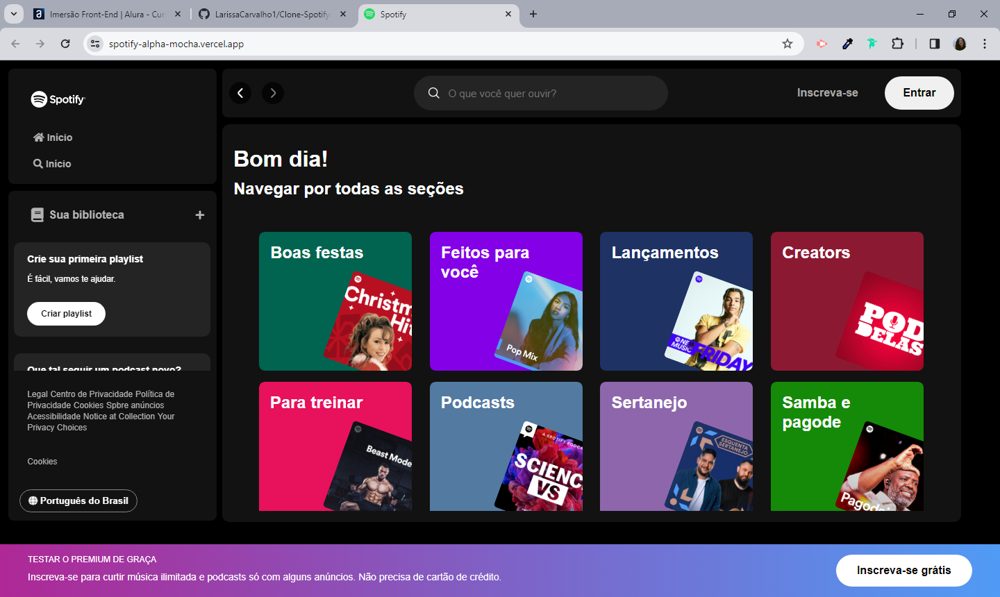

# 🟢 Clone-Spotify 
O projeto foi desenvolvido durante a "Imersão Front-End Alura", na qual foram abordados diferentes conceitos de CSS e JavaScript, como pseudo-classes, css grid, manipulação do DOM, dentre outros.
E, por meio do clone do Spotify, pude explorar e reforçar alguns desses conceitos.

🔗 Acesse o projeto [aqui](https://spotify-alpha-mocha.vercel.app/)

 
